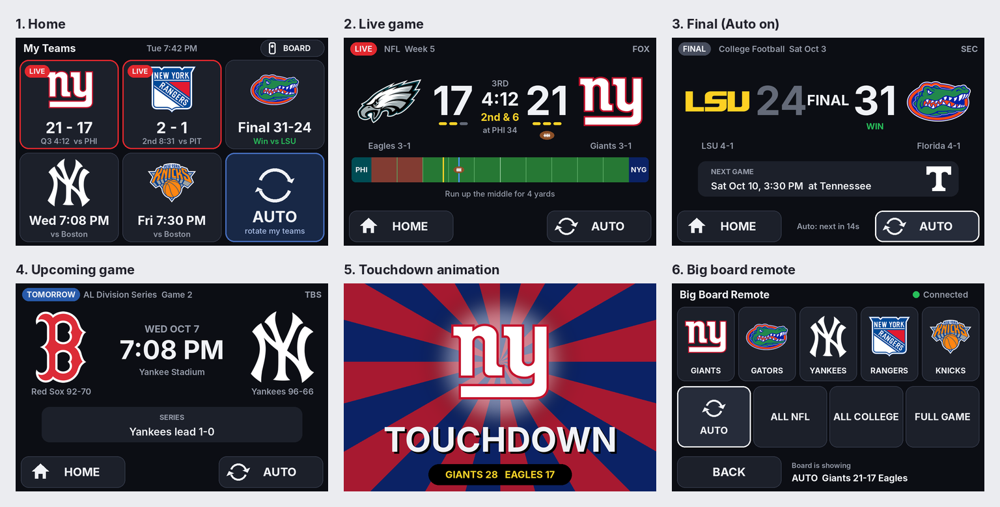

# Mini Scoreboard

A desk-sized mini scoreboard on a 4.0" ESP32 touch screen (480x320). It shows
your favourite teams' games with sharp logos, rotates through them on Auto,
pops up red zone alerts, and can work as a remote for the big LED board.

Companion to [Scoreboard](https://github.com/jdebiase86/Scoreboard), the
64x64 LED board. They live in separate repos so each one's updates stay
separate.

Status: stage 1 of the firmware (screen, touch, Wi-Fi setup) written, waiting for its first run on the board. Put it on from a web browser: flash/README.md.

- design/DESIGN.md: the settled design and technical notes
- design/mini_mockups.png, mini_redzone.png, mini_redzone_opp.png: mock-ups
- design/mock_mini.py: draws the mock-ups (uses Scoreboard's real logos)
- firmware/: the mini's firmware and hardware test (firmware/README.md)
- design/mini_stage1.png: stage 1's screens, drawn by the firmware itself

